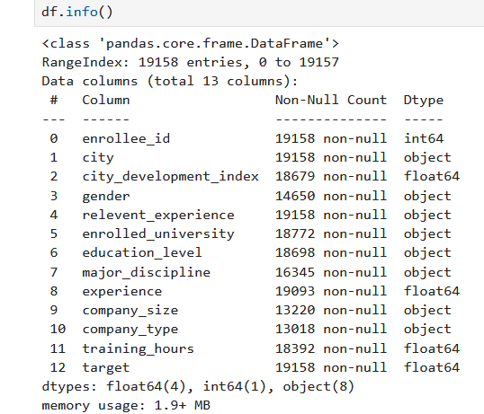
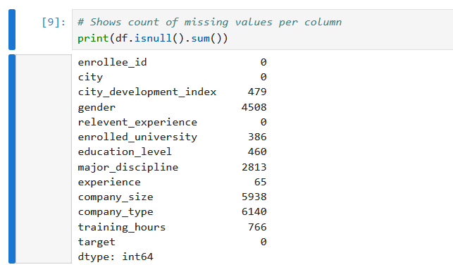
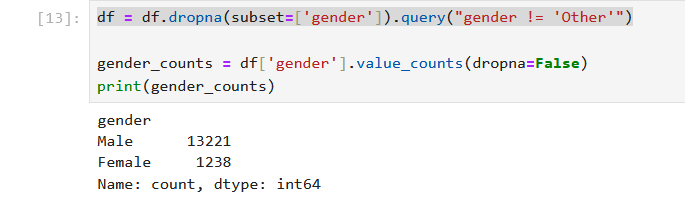
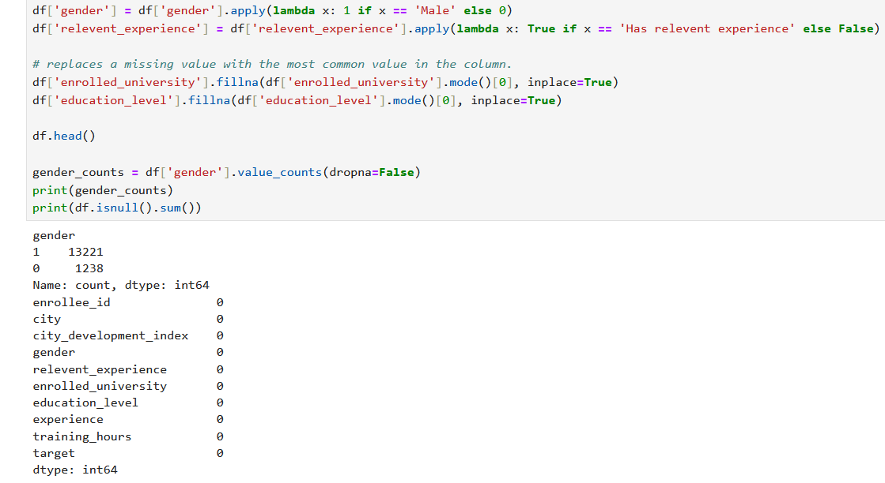
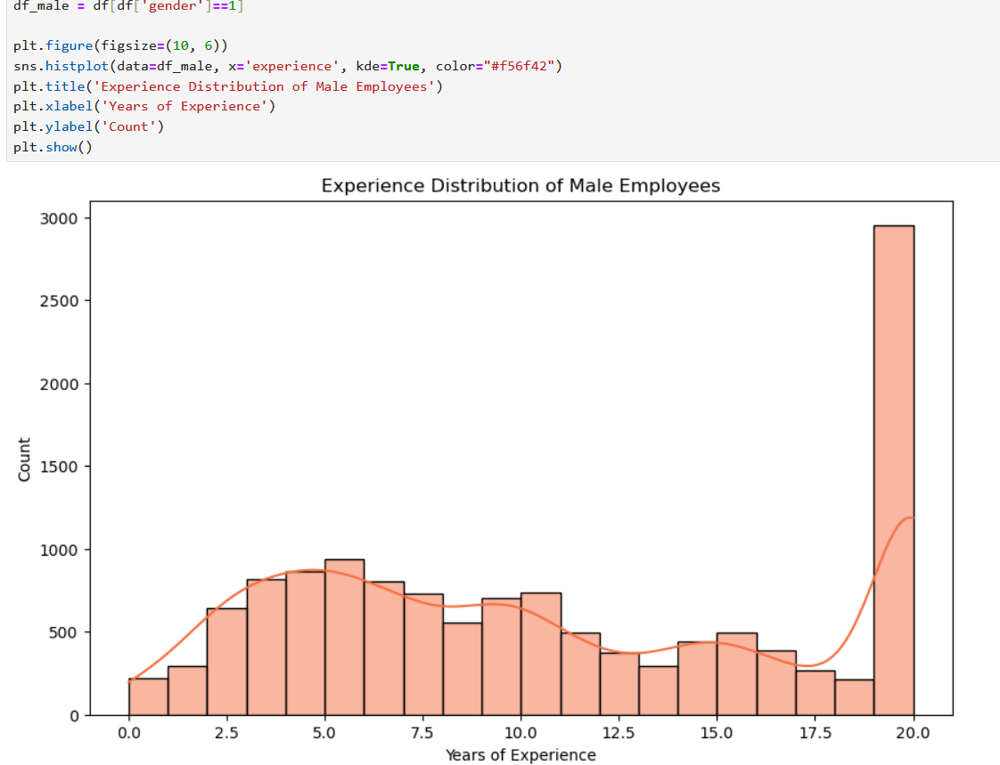
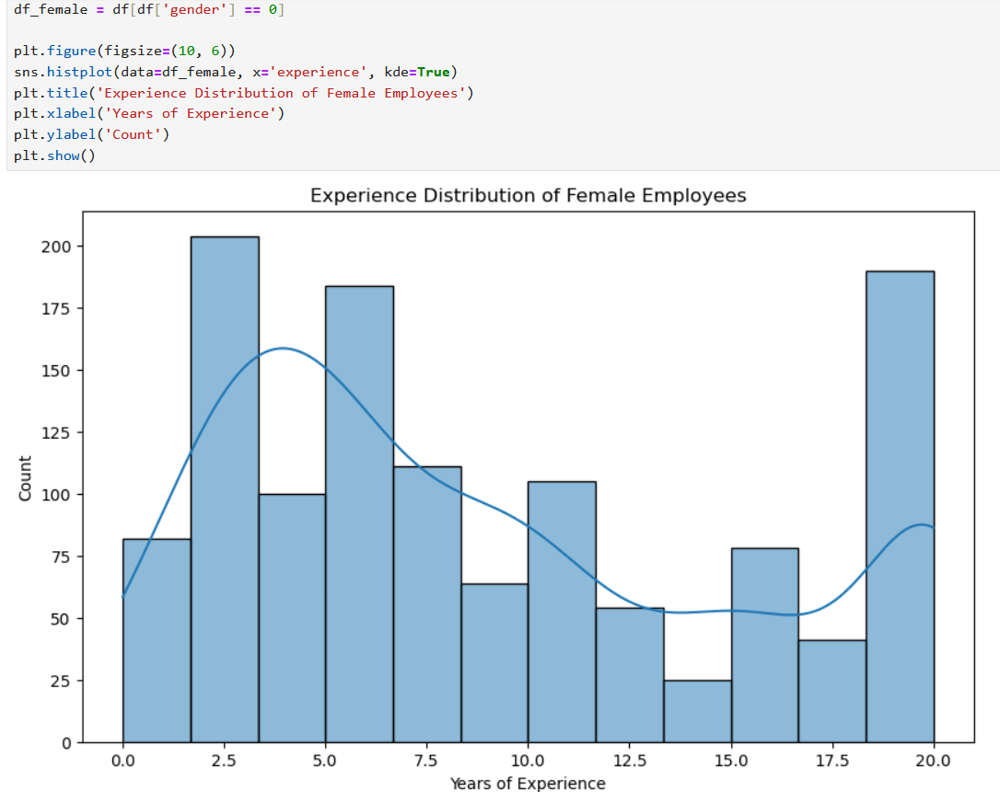

# AI/Machine Learning - OLA1

## Task 1: Data Exploration and Cleaning

### 1. Find and Download a Dataset: Use Kaggle to find a dataset of interest. It should have both numerical and categorical data and some missing values.

We found this dataset https://www.kaggle.com/datasets/sachinkumar62/datascience-job-data?resource=download The description from the website is as follows.

*This dataset contains information on job candidates applying for data science roles. It includes demographic details, education background, work experience, and training hours. The target variable indicates whether a candidate is looking for a new job (1) or not (0).*

### 2. Data Exploration:
- Load the dataset using pandas.
- Use .describe(), .info(), and .head() to explore the dataset's structure,
summary statistics, and first few rows. Use comments or markdown
cells to explain the data.

We examined the data with df.info() which shows the data type of all columns. integer/objects(strings)/floats etc. This allows us to determine which columns we can interpolate and which columns needs a replacement in the form of a most common value in the column.

df.describe() provides general statistical data such as the mean, 25%, 50%, 75% min/max values.

df.isnull().sum() sums up the amount of missing values in each column so we know where to focus our efforts.

### 3. Data Cleaning:
- Identify columns with missing values.
- For numerical columns, interpolate missing values.
- For categorical columns, replace missing values with the mode or
another standard technique (such as the mean of the two adjacent data
points)
- Drop columns with more than 50% missing values.
- Drop extreme outliers and explain why they were considered outliers

When dealing with missing values we can either delete the row or try to calculate/determine a fitting value.

As Gender was 1 of the more interesting columsn to analyze we decided to clean that column up. First we removed all NaN values and then removed any entries with "other".

We then turned the Male/Female into a 1/0. We did the same to relevant experience as it also contained either "has relevant experience" or "has no relevant experience".

For other columns of data type object(string) we replaced NaN values with the most common value in the column. 

We also decided to entirely drop the columns company_size and company_type. Our result is a clean dataset ready for visual presentation.

### 4. Data Visualization:
- Use matplotlib or seaborn to visualize the distribution of variables both
quantitative and categorical (parametric and non-parametric)

We looked at the experience for genders. 

## Task 2: Feature Engineering and Descriptive Statistics