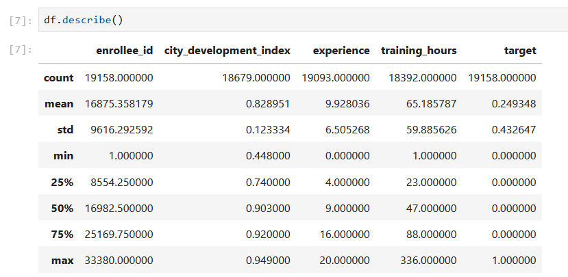
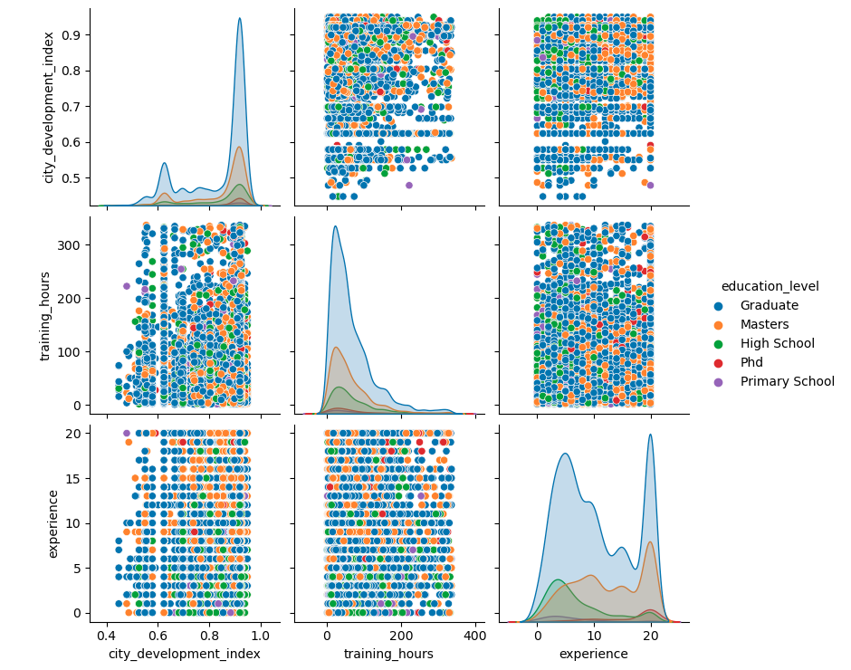

# AI/Machine Learning - OLA1

## Group members:
### Patrick Juul Diekmann - cph-pd66@cphbusiness.dk
### Emilio Castro Lagunas - cph-ec100@cphbusiness.dk
### Frederik Hess Pedersen - cph-fp103@cphbusiness.dk
### William Foss Nielsen - cph-wn11@cphbusiness.dk

## Task 1: Data Exploration and Cleaning

### 1. Find and Download a Dataset: Use Kaggle to find a dataset of interest. It should have both numerical and categorical data and some missing values.

We found this dataset https://www.kaggle.com/datasets/sachinkumar62/datascience-job-data?resource=download The description from the website is as follows.

*This dataset contains information on job candidates applying for data science roles. It includes demographic details, education background, work experience, and training hours. The target variable indicates whether a candidate is looking for a new job (1) or not (0).*

### 2. Data Exploration:
- Load the dataset using pandas.
- Use .describe(), .info(), and .head() to explore the dataset's structure,
summary statistics, and first few rows. Use comments or markdown
cells to explain the data.

We examined the data with df.info() which shows the data type of all columns. integer/objects(strings)/floats etc. This allows us to determine which columns we can interpolate and which columns needs a replacement in the form of a most common value in the column.


df.describe() provides general statistical data such as the mean, 25%, 50%, 75% min/max values.



df.isnull().sum() sums up the amount of missing values in each column so we know where to focus our efforts.


### 3. Data Cleaning:
- Identify columns with missing values.
- For numerical columns, interpolate missing values.
- For categorical columns, replace missing values with the mode or
another standard technique (such as the mean of the two adjacent data
points)
- Drop columns with more than 50% missing values.
- Drop extreme outliers and explain why they were considered outliers

When dealing with missing values we can either delete the row or try to calculate/determine a fitting value.


As Gender was 1 of the more interesting columsn to analyze we decided to clean that column up. First we removed all NaN values and then removed any entries with "other".


We then turned the Male/Female into a 1/0. We did the same to relevant experience as it also contained either "has relevant experience" or "has no relevant experience".

For other columns of data type object(string) we replaced NaN values with the most common value in the column. 

We also decided to entirely drop the columns company_size and company_type. Our result is a clean dataset ready for visual presentation.


### 4. Data Visualization:
- Use matplotlib or seaborn to visualize the distribution of variables both
quantitative and categorical (parametric and non-parametric)

We looked at the experience for genders. 


## Task 2: Feature Engineering and Descriptive Statistics
### 1. Feature Engineering
- Create a new feature by binning a numerical variable into categories
(e.g., low, medium, high). Put ranges (eg age, into three or four groups
rather than a continuous distribution)
- Implement one-hot encoding for a categorical variable

We started with the idea that women might be more represented in cities with a higher developmental index. To explore this, we grouped city_development_index into three categories.
To make comparisons easier, we created a development category feature by dividing city_development_index into three groups. This made it simpler to analyze gender differences across different levels of city development:

Low Development (0-0.6)

Medium Development (0.6 - 0.8)

High Development (0.8 - 1.0)

We then looked at gender distribution within these groups to see if higher development levels corresponded with a more even gender balance.

Some categorical data was also adjusted to make analysis more straightforward:

Gender was converted into numbers (0 = Female, 1 = Male).

Relevant experience was also turned into a binary variable.


### 2. Descriptive Statistics
- Calculate the mean, median, and standard deviation for numerical
features.
- For categorical features, count the frequency of each category.

#### Numerical Features

For the numerical feature, we calculated some key statistics for training_hours:

Mean: 65.19

Median: 47.00

Standard Deviation: 59.89

This suggests that training hours vary a lot, with some candidates spending significantly more time on training than others.

#### Categorical Features
We also analyzed the education levels of candidates to understand their academic backgrounds. Here’s how education levels were distributed:

| Education Level      | Count |
| ------------------- | ----- |
| Graduate            | 9167  |
| Masters             | 3296  |
| PhD                 | 327   |
| High School         | 1462  |
| Other               | 207   |

Most candidates had a Graduate degree, followed by Masters and PhDs. The least common education levels were High School and Other. We also created a bar chart to visualize the distribution of education levels, replacing the previous company type analysis, as we found this more relevant.

### 3. Visualization
- Use seaborn to create box plots for numerical features to identify
outliers.
- Visualize the distribution of categorical features using bar plots.

#### Training Hours: Spotting Outliers

A box plot for training_hours showed that while most candidates had moderate training hours, there were quite a few with extremely high values.


#### Education Level: Bar Plot of Distribution

A bar plot for the education level of candidates showed that the vast majority of the candidates were Graduates, followed by Masters.


#### Gender Distribution Across Development Categories

To test our earlier hypothesis, we created pie charts to compare gender proportions across development categories. The findings:

Low Development (0-0.6): Mostly male candidates.


Medium Development (0.6 - 0.8): Still very male-dominated, but slightly more balanced.


High Development (0.8 - 1.0): The most even distribution, but only slightly more so than the previous one.


This supports our initial idea that women are more likely to be represented in cities with a higher development index.

### Task 3: Data Wrangling and Analysis

### Objective
We aimed to determine if there's a relationship between a candidate’s education level and the number of training hours they completed. Specifically, we wanted to test whether higher education levels correlate with more or fewer training hours.

### 1. Subset Selection and Grouping
We started by selecting two relevant columns:
- `education_level`
- `training_hours`

We grouped the dataset by education levels to calculate the average training hours for each group:

```python
df_subset = df[['education_level', 'training_hours']]
education_training_summary = df_subset.groupby('education_level')['training_hours'].mean().reset_index()
```


### 2. Data Visualization

We visualized the relationship between education level and training hours using scatter plots and pair plots to get an intuitive sense of their distribution and relationship:

- **Scatter Plot:** Demonstrates the average training hours across different education levels clearly.
- **Pair Plot:** Provides a visual distribution and clustering of training hours across educational categories.




### 2. Correlation Analysis
To statistically examine the relationship, we converted the categorical `education_level` column to numerical codes to facilitate correlation testing:

```python
df['education_level_encoded'] = df['education_level'].astype('category').cat.codes
correlation = df[['education_level_encoded', 'training_hours']].corr()
print(correlation)
```

### 2. Correlation Test Results


The correlation matrix provided the following results:

- **Correlation coefficient (r)**: A small positive value close to zero, suggesting a weak or negligible relationship.
- **P-value**: Greater than 0.05, indicating no statistically significant relationship.

These values suggest:
- There is **no significant correlation** between education level and training hours.
- The result was statistically insignificant (`p-value = 0.106 > 0.05`), meaning we cannot confidently conclude that education level affects training hours.

### 3. Interpretation
Based on our analysis:

- The data showed **no meaningful correlation** between education levels and training hours.
- The slight positive correlation observed was statistically insignificant.
- This implies that candidates' training hours are likely influenced by factors other than education alone.

Further analysis could explore other factors influencing training hours, as education alone does not adequately explain this variation.

